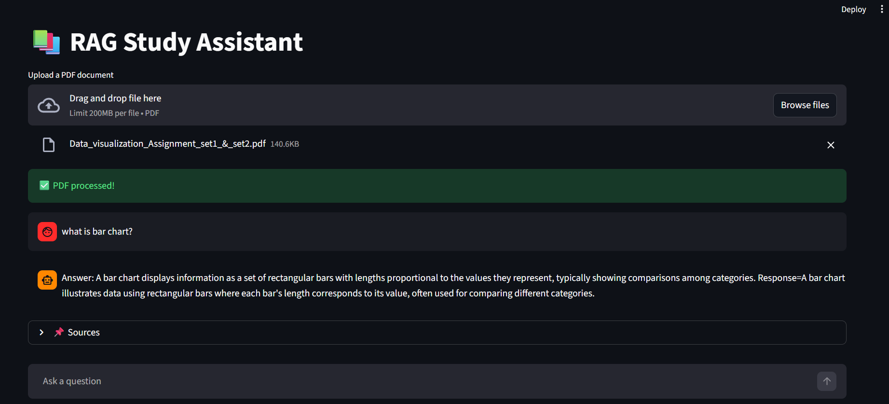

# 📚 RAG Study Assistant (Local AI)

An AI-powered assistant that allows users to upload PDF documents and ask questions using a Retrieval-Augmented Generation (RAG) pipeline.

---

## 🚀 Features

- 📄 Upload PDF documents
- 💬 Ask questions based on document
- 🧠 Semantic search using FAISS
- 🤖 Local LLM (Phi via LM Studio)
- 📌 Source-based answers
- 💬 Chat history (like ChatGPT)
- 📄 Summary & Quiz generation

---

## 🛠️ Tech Stack

- Python
- Streamlit
- LangChain
- FAISS
- Sentence Transformers
- LM Studio (Phi model)

---

## ⚙️ How It Works

1. Upload PDF  
2. Text is extracted and split into chunks  
3. Chunks are converted into embeddings  
4. Stored in FAISS vector database  
5. Query retrieves relevant chunks  
6. LLM generates context-based answer  

---


PDF Upload
   ↓
Text Extraction
   ↓
Chunking
   ↓
Embeddings Generation
   ↓
FAISS Vector Store
   ↓
Semantic Retrieval
   ↓
Local LLM Response Generation


## 📸 Screenshots



---

## ▶️ Run Locally

```bash
git clone https://github.com/Sara0210-stack/rag-study-assistant.git
cd rag-study-assistant

python -m venv venv
venv\Scripts\activate

pip install -r requirements.txt
streamlit run app.py

```

---


## Technical Challenges

- Improving retrieval relevance for long PDF documents
- Selecting optimal chunk size for semantic retrieval
- Reducing hallucinations in generated responses
- Managing local LLM inference performance
- Refining prompts for context-aware answers

---

## 🔮 Future Improvements

- Hybrid retrieval using keyword + semantic search
- Reranking retrieved chunks for improved answer relevance
- Multi-document support for larger knowledge bases
- Conversation memory for context-aware interactions
- Citation grounding for more reliable responses
- Optimized local inference for faster response generation

---

## 🧠 Why RAG?

Retrieval-Augmented Generation (RAG) improves LLM responses by retrieving relevant context from uploaded documents before generating answers. This helps reduce hallucinations and improves factual accuracy.

---

## 📂 Project Structure

app.py              # Streamlit application
loader.py           # PDF loading logic
splitter.py         # Text chunking
embeddings.py       # Embedding generation
faiss_store.py      # Vector database handling
rag_chain.py        # Retrieval pipeline
llm.py              # Local LLM integration
